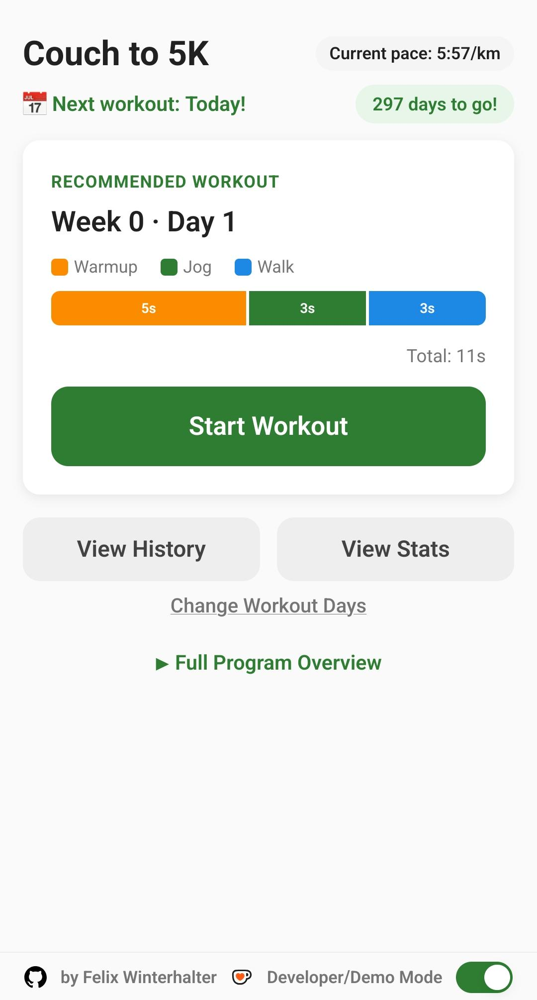
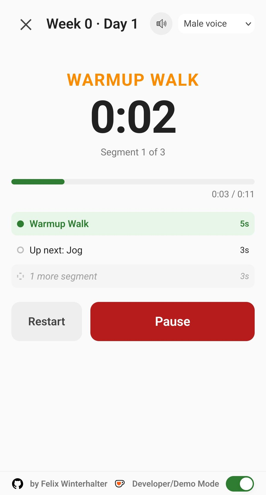
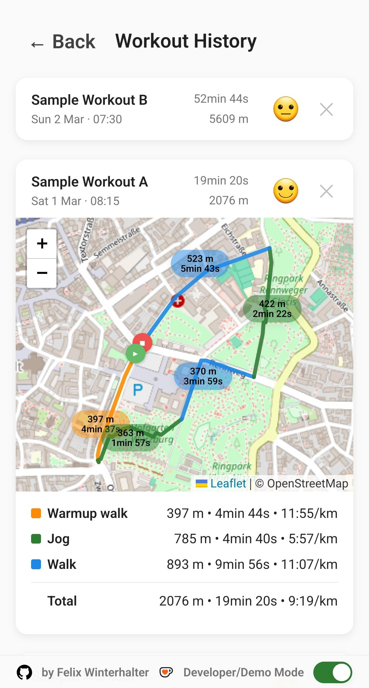
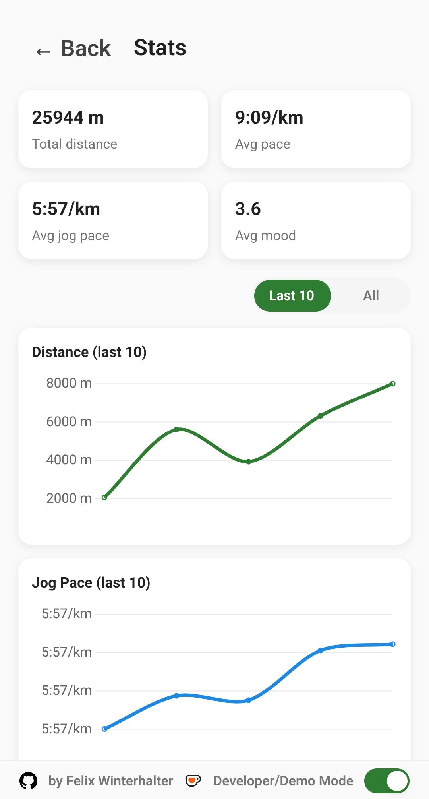

## What is this?
[Couch to 5k](https://c25k.com/c25k_plan/) (C25K) is a running program to get someone with no running experience to run a 5k in 8-9 weeks, and this is a companion app for it, with adaptations inspired by [this](https://www.halhigdon.com/training-programs/10k-training/novice-10k/) 10k plan to get the final distance to ~10km.

No login or download required (Available as PWA), no ads, completely free, and all your data stays on your device.

## Screenshots

  
  
  
  

## Features
- Preset workout following the plan linked above
- Voice instructions during workouts (Or beeps if you don't like people, or nothing at all if you like looking at your screen while you run, I don't)
- GPS tracking + map with workout overview
- Various stats + visualizations

## Why?
Because I can.

I didn't want to bother with 3rd party apps or websites, had a pretty specific set of features in mind and as a pretty self-contained and small project, this seemed perfect for a coding agent of my choice (In this case a bit of Opus 4.6 until I realized it eats premium requests like candy, so most of this was done with GPT-5.2/3 Codex instead). 

TTS powered by Elevenlabs

## What's Developer Mode?
Dev mode switches to dummy workout data so I can iterate faster when making changes. Nothing to be gained here I'm afraid (Feel free to enable it to get an idea of what the stats page can look like though!)

## Known Issues
- Audio playback while in background/lock screen in some cases, Firefox mobile app seems to work fine
